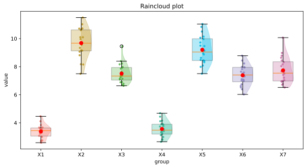

# Raincloud Plot Python Script

This script provides a customizable implementation of raincloud plots using Python and Matplotlib. Raincloud plots combine boxplots, violin plots, and scatterplots to give a comprehensive visualization of data distribution, variability, and individual data points.

---

## Features

- **Customizable Colors**: Supports a library of colors for visual distinction.
- **Flexible Orientation**: Plots can be vertical or horizontal.
- **Transparency and Size Settings**: Configure alpha values and sizes for the plots.
- **Violin and Box Plot Combination**: Displays upper halves of violin plots along with boxplots.
- **Scatterplot Overlay**: Adds jittered scatterplots to visualize individual data points.
- **Mean Visualization**: Optionally shows mean values as markers.
- **Save Figure**: Optionally save the plot as a high-resolution SVG file.

---

## Prerequisites

- **Python 3.6 or later**
- **Required Libraries**:
  - `numpy`
  - `matplotlib`

Install these libraries using pip:

```bash
pip install numpy matplotlib
```

---

## Script Components

### 1. **Color Library**
A predefined set of colors is used for visualizing multiple groups:
```python
colors_lib = ['#F27970', '#BB9727', '#54B345', '#32B897', '#05B9E2', '#8983BF',
              '#C76DA2', '#934B43', '#D76364', '#EF7A6D', '#F1D77E', '#B1CE46',
              '#63E398', '#9394E7', '#5F97D2', '#9DC3E7', '#A1A9D0', '#F0988C',
              '#B883D4', '#9E9E9E', '#CFEAF1', '#C4A5DE', '#F6CAE5', '#96CCCB']
```

### 2. **`Crt_normal_array` Function**
Generates normally distributed random data based on a specified range and size.

```python
def Crt_normal_array(low, high, size):
    mean = (low + high) / 2
    std = (high - low) / 6
    data = np.random.normal(mean, std, size)
    return data
```

### 3. **`raincloudplot` Function**
Creates the raincloud plot with the following parameters:

| Parameter        | Description                                                   | Default Value           |
|------------------|---------------------------------------------------------------|-------------------------|
| `data`           | List of data arrays to plot.                                   | Required                |
| `label`          | Labels for each data group.                                   | Required                |
| `fig_width`      | Width of the figure.                                          | `8`                     |
| `fig_height`     | Height of the figure.                                         | `4`                     |
| `color_map`      | List of colors for the plots.                                 | `colors_lib`            |
| `if_vert`        | Orientation of the plot (`True` = vertical, `False` = horizontal). | `True`                  |
| `box_alpha`      | Transparency of the boxplots.                                 | `0.3`                   |
| `scatter_size`   | Size of scatterplot markers.                                  | `1`                     |
| `scatter_alpha`  | Transparency of scatterplot markers.                          | `0.8`                   |
| `xlabel`         | Label for the x-axis.                                         | `'group'`               |
| `ylabel`         | Label for the y-axis.                                         | `'value'`               |
| `title`          | Title of the plot.                                            | `'Raincloud plot'`      |
| `figname`        | File name to save the figure.                                 | `''` (no saving)        |
| `show_mean`      | Whether to display the mean marker.                           | `True`                  |
| `mean_color`     | Color of the mean marker.                                     | `'red'`                 |
| `y_lim`          | Y-axis limits (if specified).                                 | `[]`                    |

---

## Usage

### Generating and Visualizing Data

The script can generate random data using the `Crt_normal_array` function and visualize it using the `raincloudplot` function. Below is an example:

```python
if __name__ == '__main__':
    # Generate random datasets
    x1 = Crt_normal_array(2, 5, 20)
    x2 = Crt_normal_array(6, 13, 20)
    x3 = Crt_normal_array(5, 10, 20)
    x4 = Crt_normal_array(2, 5, 20)
    x5 = Crt_normal_array(6, 13, 20)
    x6 = Crt_normal_array(5, 10, 20)
    x7 = Crt_normal_array(5, 10, 20)

    # Combine data
    data_x = [x1, x2, x3, x4, x5, x6, x7]

    # Create the raincloud plot
    raincloudplot(data_x, ['X1', 'X2', 'X3', 'X4', 'X5', 'X6', 'X7'],
                  fig_width=10, fig_height=5, scatter_size=10,
                  figname='./output.svg')
```

### Output
This code will generate a raincloud plot for seven datasets, each labeled from `X1` to `X7`.

---

## Customization

### Change Colors
Update the `color_map` parameter to use a custom list of colors.

### Save the Figure
Set the `figname` parameter to save the plot:

```python
raincloudplot(data_x, labels, figname='raincloud_plot.svg')
```

### Adjust Plot Appearance
- Use `fig_width` and `fig_height` to control figure dimensions.
- Set `scatter_size` and `scatter_alpha` to adjust scatterplot marker properties.
- Change `box_alpha` for boxplot transparency.

---

## Example Output
The raincloud plot provides:

1. **Boxplots** to display medians and quartiles.
2. **Violin Plots** to show kernel density estimation.
3. **Scatterplots** for individual data points with jitter.

---

## License
This script is released under the MIT License. Feel free to use and modify it for personal or commercial purposes.

---

## Contact
For questions or suggestions, please submit an issue in the repository.

